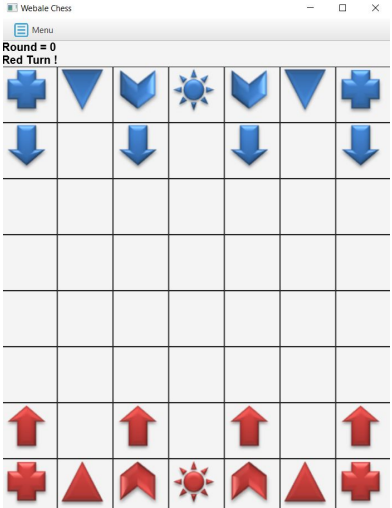
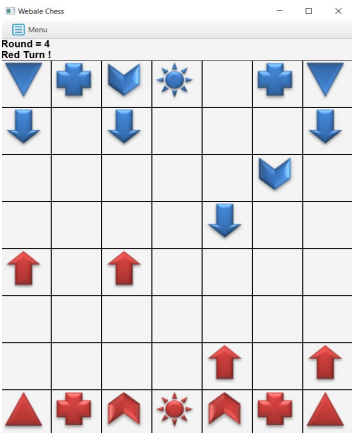

# Webale-Chess
A Java GUI-based Webale Chess game

For more info, can refer the documentation pdf file in the reference folder

# How to start the game?
1. Clone this repo
2. Run javac  *.java on cmd/terminal to create java class file
3. Run java WebaleApp to start the game

# Sample images of this game

